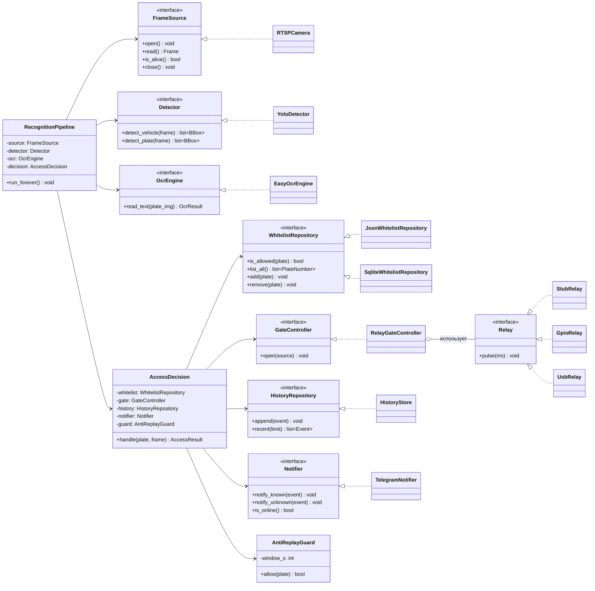
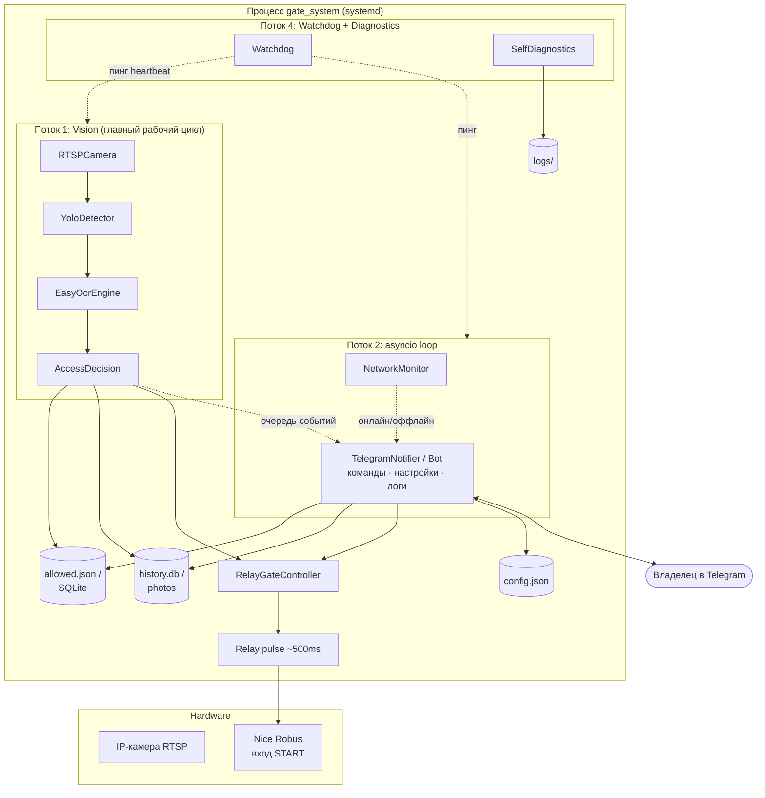
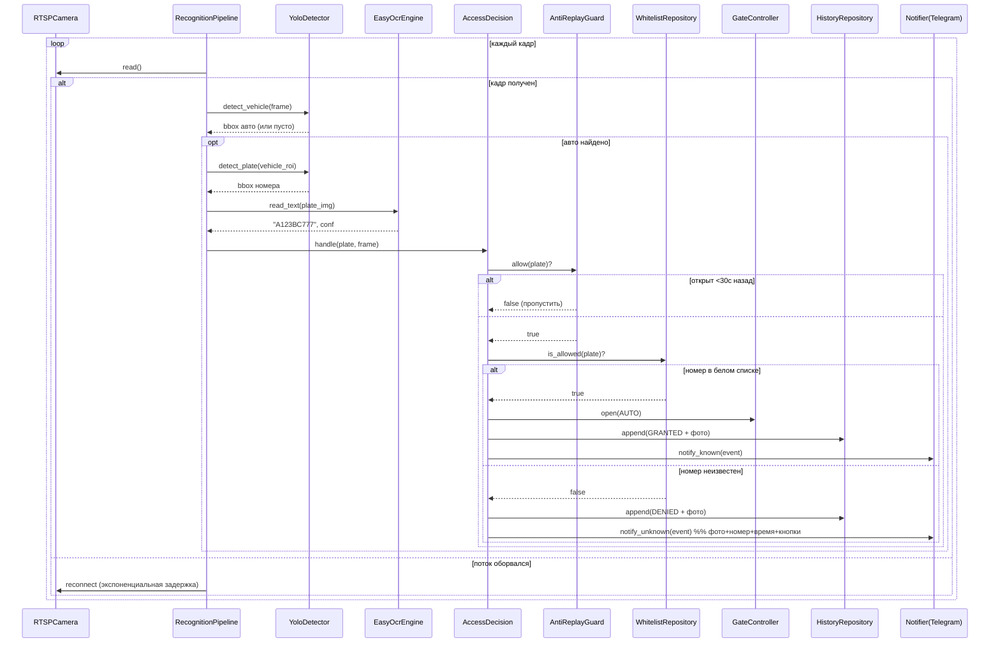

# Система автоматического открытия ворот по автомобильному номеру

## Архитектурный документ (Этап 0)

Версия: 1.0 · Дата: 2026-07-13
Платформа разработки: macOS · Платформа эксплуатации: Raspberry Pi OS Lite (RPi 4 4GB / RPi 5)
Стек: Python 3.12 · OpenCV · YOLOv8n · EasyOCR · python-telegram-bot
Управление и мониторинг — полностью через Telegram-бота (отдельный веб-интерфейс не используется).

---

## 1. Цель и главный архитектурный принцип

Приложение работает 24/7, полностью локально, анализирует RTSP-поток с IP-камеры,
распознаёт автомобильные номера, сверяет их с белым списком и по короткому замыканию
реле имитирует нажатие кнопки START (STEP-BY-STEP) автоматики **Nice Robus**.

Главный принцип проектирования — **инверсия зависимостей (Dependency Inversion)**.
Бизнес-логика (ядро) не зависит ни от способа открытия ворот, ни от способа хранения
данных, ни от способа доставки уведомлений. Она зависит только от **абстракций (портов)**.
Конкретные реализации (**адаптеры**) подключаются на этапе сборки приложения.

Именно это даёт два ключевых требования ТЗ «бесплатно»:

| Требование ТЗ | Как обеспечивается |
|---|---|
| На RPi заменить только модуль ворот, остальная логика неизменна | Порт `GateController` + сменные адаптеры (`StubRelay` → `GpioRelay` / `UsbRelay`) |
| Позже заменить JSON на SQLite без изменения бизнес-логики | Порт `WhitelistRepository` + адаптеры (`JsonWhitelistRepository` → `SqliteWhitelistRepository`) |
| Работа без интернета | Telegram — это адаптер порта `Notifier`; его отказ не влияет на ядро |

---

## 2. Слои (Clean Architecture)

Зависимости направлены **только внутрь**: внешние слои знают о внутренних, но не наоборот.

```
┌───────────────────────────────────────────────────────────────┐
│  ИНФРАСТРУКТУРА / АДАПТЕРЫ (внешний слой)                       │
│  camera.py  detector.py  ocr.py  relay.py  telegram_bot.py     │
│  database.py  network.py  watchdog.py  diagnostics.py          │
│      │ реализуют порты        ▲ вызывают use case               │
├──────┼────────────────────────┼───────────────────────────────┤
│      ▼   ПОРТЫ (interfaces.py) │                                │
│  FrameSource · Detector · OcrEngine · GateController ·         │
│  WhitelistRepository · HistoryRepository · Notifier            │
├───────────────────────────────────────────────────────────────┤
│  ПРИКЛАДНАЯ ЛОГИКА (use cases)                                  │
│  RecognitionPipeline · AccessDecision · AntiReplayGuard        │
├───────────────────────────────────────────────────────────────┤
│  ДОМЕН (models.py) — сущности, без внешних зависимостей         │
│  PlateNumber · Vehicle · Event · AccessResult · OpenSource     │
└───────────────────────────────────────────────────────────────┘
```

* **Домен** (`models.py`) — чистые dataclass-сущности и enum. Не импортирует ни OpenCV,
  ни python-telegram-bot — ничего внешнего.
* **Порты** (`interfaces.py`) — абстрактные классы (`abc.ABC`). Контракты, от которых
  зависит ядро.
* **Прикладная логика** — сценарии: пайплайн распознавания, решение о доступе,
  защита от повторного открытия. Зависит только от портов и домена.
* **Адаптеры** — конкретные реализации портов и точки ввода-вывода (камера, сеть,
  Telegram, веб, реле, БД).

---

## 3. UML: диаграмма классов (порты и адаптеры)



Ключевой момент: `RelayGateController` реализует порт `GateController`, а сам внутри
зависит от под-порта `Relay`. На macOS в него внедряется `StubRelay` (печатает
`Gate opened`), на RPi — `GpioRelay` или `UsbRelay`. **Ни строчки в ядре не меняется.**

---

## 4. UML: диаграмма компонентов и потоков (runtime)

Приложение — многопоточное. Тяжёлый CV-пайплайн и async-сервисы (Telegram, веб)
разнесены, чтобы отказ или блокировка одного не останавливали другое.



**Разделение потоков:**
* **T1 Vision** — синхронный «горячий» цикл: захват кадра → детекция → OCR → решение.
  Самый нагруженный, изолирован от сети.
* **T2 asyncio** — Telegram-бот (единый интерфейс: команды, настройки, просмотр
  логов) и монитор сети. Общается с ядром через потокобезопасную очередь событий;
  переподключается сам при возврате интернета.
* **T4 Watchdog/Diagnostics** — следит за «сердцебиением» потоков и здоровьем системы
  (камера, OCR, память, температура, диск), пишет в журнал.

---

## 5. UML: диаграмма последовательности (распознавание → открытие)



---

## 6. Описание взаимодействия модулей

| Файл | Слой | Ответственность | Зависит от (порты) |
|---|---|---|---|
| `models.py` | Домен | Сущности `PlateNumber`, `Vehicle`, `Event`, `AccessResult`, enum `OpenSource`, `CheckResult` | — |
| `interfaces.py` | Порты | Абстрактные контракты всех адаптеров (`abc.ABC`) | domain |
| `config.py` | Инфра | Загрузка/валидация `config.json`, типизированные секции, дефолты | — |
| `logger.py` | Инфра | Настройка `logging` (файл + консоль, ротация), единый формат | config |
| `camera.py` | Адаптер | `RTSPCamera(FrameSource)` — захват через OpenCV, авто-переподключение | FrameSource |
| `detector.py` | Адаптер | `YoloDetector(Detector)` — YOLOv8n: авто + номерной знак | Detector |
| `ocr.py` | Адаптер | `EasyOcrEngine(OcrEngine)` — распознавание текста, нормализация номера РФ | OcrEngine |
| `relay.py` | Адаптер | `Relay` + `StubRelay`/`GpioRelay`/`UsbRelay` — импульс ~500 мс | Relay |
| `gate_controller.py` | Адаптер | `RelayGateController(GateController)` — политика открытия, лог источника | GateController, Relay |
| `database.py` | Адаптер | Низкоуровневый доступ (JSON-файлы сейчас, SQLite позже) | — |
| `history.py` | Адаптер | `HistoryStore(HistoryRepository)` — события + сохранение фото | HistoryRepository |
| `whitelist.py`¹ | Адаптер | `JsonWhitelistRepository` / `SqliteWhitelistRepository` | WhitelistRepository |
| `telegram_bot.py` | Адаптер | `TelegramNotifier(Notifier)` + `CommandRouter`: все команды, настройки (`/set`), логи (`/logs`), авто-reconnect | Notifier, репозитории, GateController, ConfigStore |
| `network.py` | Адаптер | `NetworkMonitor` — определяет онлайн/оффлайн, события смены | — |
| `watchdog.py` | Инфра | Heartbeat потоков, перезапуск зависших подсистем | — |
| `diagnostics.py`¹ | Инфра | Периодические self-check: камера/OCR/память/темп./диск | — |
| `utils.py` | Инфра | Общие утилиты (нормализация номера, работа с изображениями) | — |
| `pipeline.py`¹ | Use case | `RecognitionPipeline`, `AccessDecision`, `AntiReplayGuard` | порты + домен |
| `main.py` | Composition Root | Сборка графа зависимостей, запуск потоков, graceful shutdown | всё |

¹ Файлы, добавленные к исходной структуре ТЗ ради чистоты слоёв. Обоснование в §8.

**Composition Root (`main.py`)** — единственное место, где выбираются конкретные
адаптеры. Пример смены платформы:

```python
# macOS (разработка)
relay = StubRelay()
whitelist = JsonWhitelistRepository(cfg.paths.allowed)

# Raspberry Pi (эксплуатация) — меняются ТОЛЬКО эти две строки
relay = GpioRelay(pin=cfg.relay.gpio_pin)
whitelist = SqliteWhitelistRepository(cfg.paths.db)
```

---

## 7. Стратегии надёжности (mapping требований ТЗ → механизм)

| Требование | Механизм |
|---|---|
| Обрыв RTSP / камера не отвечает | `RTSPCamera.read()` ловит пустой кадр → reconnect с экспоненциальной задержкой (1→2→4…→30с), логирование каждой попытки |
| Потеря интернета | `NetworkMonitor` переводит `TelegramNotifier` в оффлайн; ядро работает без изменений; события копятся в очередь |
| Восстановление интернета | `NetworkMonitor` эмитит `online` → бот переподключается **без перезапуска** процесса, очередь досылается |
| Повторное открытие | `AntiReplayGuard`: словарь `{plate: last_open_ts}`, окно 30 с |
| Аварийное завершение процесса | systemd `Restart=always`, `RestartSec=3` |
| Отключение электричества | systemd-сервис `enabled` + `WantedBy=multi-user.target` → автозапуск после загрузки |
| Зависание потока | `Watchdog` по heartbeat перезапускает подсистему/процесс |
| Диагностика | `SelfDiagnostics` раз в N секунд проверяет камеру/OCR/Telegram/RAM/темп./диск → журнал |
| Логирование всех исключений | Глобальный `sys.excepthook` + `try/except` на границах потоков → `logger` |

---

## 8. Отступления от исходной структуры (обоснование)

Структура из ТЗ сохранена практически дословно (плоский набор модулей в `gate_system/`).
Добавлены **три файла** ради выполнения требований «чистая архитектура» и
«заменяемость без переработки»:

1. `models.py` — доменные сущности. Без них бизнес-данные «размазались» бы по модулям.
2. `interfaces.py` — порты (ABC). Ядро требования о заменяемости ворот и хранилища.
3. `pipeline.py` — вынесенные use cases, чтобы `main.py` остался тонким Composition Root.

Плюс `diagnostics.py` выделен из `watchdog.py` (в ТЗ самодиагностика описана отдельным
разделом). `whitelist.py` отделён от `database.py`: `database.py` — низкоуровневый
доступ, `whitelist.py` — репозиторий поверх него.

Всё остальное — 1:1 с ТЗ.

---

## 9. Порядок реализации (пошаговый, по этапам)

Каждый этап: объяснение решения → код → тест → фикс → только затем следующий.

| Этап | Что реализуем | Как проверяем |
|---|---|---|
| **0** ✅ | Архитектура + каркас репозитория (этот документ) | Импортируемость `config/logger/models/interfaces` |
| **1** | `config.py` + `logger.py` + `models.py` + `interfaces.py` (полностью) | Unit-тесты загрузки конфига, валидации, логов |
| **2** | `camera.py` (RTSP + reconnect) | Тест на видеофайле-заглушке и реальном RTSP |
| **3** | `detector.py` (YOLOv8n) | Детекция авто/номера на тестовых кадрах |
| **4** | `ocr.py` (EasyOCR + нормализация РФ) | Точность на наборе фото номеров |
| **5** | `relay.py` + `gate_controller.py` (`StubRelay`) | `open_gate()` печатает «Gate opened», импульс 500 мс мокируется |
| **6** | `whitelist.py` + `history.py` + `database.py` (JSON) | CRUD белого списка, запись событий+фото |
| **7** | `pipeline.py` (склейка ядра) + `AntiReplayGuard` | Интеграционный тест полного цикла на видео-заглушке |
| **8** | `network.py` + `telegram_bot.py` (бот, команды, reconnect) | Команды `/open /photo /status /history /list /add/remove`, оффлайн→онлайн |
| **9** | Перенос функций управления в бота: `/logs`, `/settings`, `/set` (вместо отдельного веб-интерфейса) | Просмотр логов и правка настроек из Telegram |
| **10** | `watchdog.py` + `diagnostics.py` | Симуляция зависания/сбоя, проверка восстановления |
| **11** | `main.py` (Composition Root, потоки, shutdown) | Запуск 24/7, нагрузочный прогон |
| **12** | Перенос на RPi: `GpioRelay`/`UsbRelay` + systemd unit | Открытие ворот пультом / номером / Telegram одновременно |

На RPi меняется только §6 (Composition Root) — выбор адаптера реле и (опц.) SQLite.

---

## 10. Кроссплатформенность (macOS ↔ Raspberry Pi OS)

* Никаких macOS-специфичных библиотек. Только кроссплатформенные: `opencv-python`,
  `ultralytics`/`onnxruntime`, `easyocr`, `python-telegram-bot`.
* GPIO изолирован в `relay.py` и импортируется **лениво**, только когда выбран
  соответствующий адаптер, — на macOS `RPi.GPIO`/`gpiozero` не импортируется вовсе.
* Пути и настройки — через `config.json`, без хардкода.
* На RPi 4 (4GB) YOLOv8n + EasyOCR укладываются в ресурсы; при необходимости —
  экспорт модели в ONNX и понижение FPS обработки (параметр в конфиге).
```
